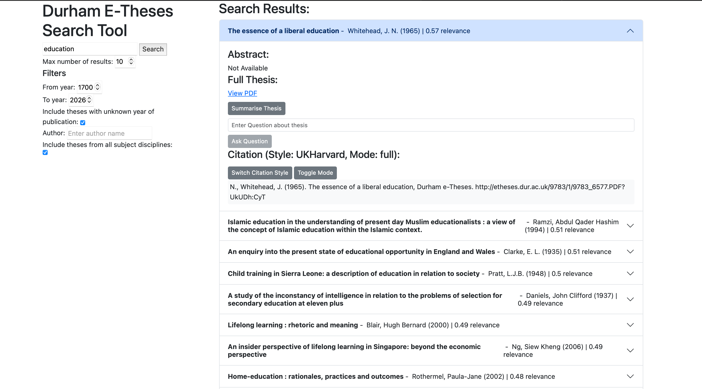
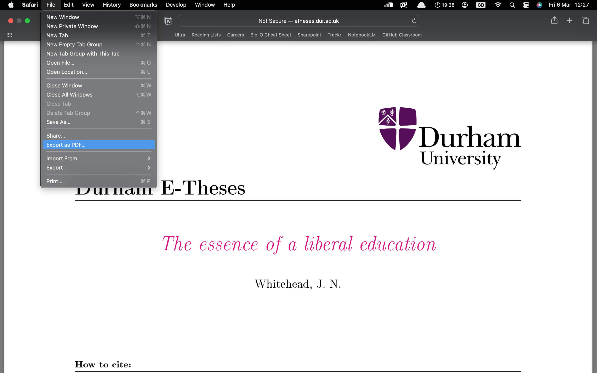
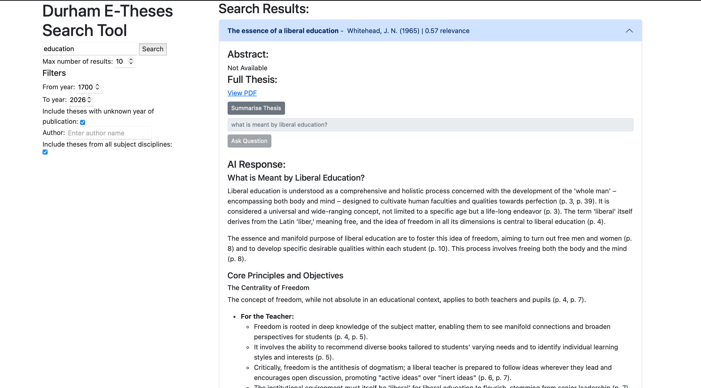

# 2.2.1 System Architecture
The following diagram shows a high-level overview of the system architecture: 

# 2.2.2 Design Principles 
## 1. Separation of Concerns
The system makes use of two independent APIs: Node.js and FastAPI, where Node.js handles the static web interface delivery and FastAPI handles the search query processing between the web interface, model, and theses database. This separation means that eahc API has a clearly defined function and purpose in the system, reducing coupling and facilitating independent unit development without necessarily affecting the overall system architecture. It also supports ease of maintenance as well. 

## 2. Efficiency of Information Retrieval 
The system was designed with the intention of significantly reducing the user's effort in finding relevant doctoral theses. The use of semantic similarity during the search query process conceptualises the user's query intent, which includes theses that may never have been discovered and reduces the number of less relevant theses suggested to the user. Furthermore, the ranking of the results from best to worst optimises this minimalisation of user effort in pinpointing the most relevant theses. Finally, the additional 'per-thesis' search feature provides the user with extensive search functionality, where, instead of having to laboriously search the thesis by hand, the user can simply enter a prompt of any specificity and a detailed response will be returned. 

## 3. Scalability
This design principle builds upon the first design principle ('Separation of Concerns'). The system's architecture supports scalable search operations by separating the frontend delivery from search query processing. Where the dataset in question is larger than the existing one, the backend FastAPI service can be quickly and easily adapted to accommodate future expansion, such as indexing larger thesis datasets or supporting additional search functionality.

## 4. Modularity and Extensibility
 The system was designed with modular components, supporting future refinements and additional features such as personalised filters, improved ranking algorithms, or alternative embedding models, all causing minimal disruption to the existing system architecture and functionality. 

## 5. Simplicity of User Interaction
The systems makes use of set of minimalistic search configurations, allowing the user to quickly perform searches and interpret results without requiring specialised technical knowledge, improving usability and accessibility.

# 2.2.3 Technologies & Platforms 
The following technologies/platforms were used with their respective roles outlined:
| Technology                                | Purpose                                      |
|--------------------------------------------|----------------------------------------------|
| Node.js (Express)                               | Node.js provides a lightweight runtime for executing JavaScript on the server, while Express simplifies the creation of HTTP servers and routing.            |
| FastAPI (Python)                                         | FastAPI is especially well suited for this component of the system because the semantic search pipeline relies heavily on Python-based machine learning and data-processing libraries such as Sentence-Transformers and FAISS. Using a Python-based API framework allows these libraries to be integrated directly into the backend service.                 |
| Pre-trained Embedding model: all-mpnet-base-v2  | This model converts natural language text into dense numerical vectors that capture the semantic meaning of sentences. This is a significant performance improvement from keyword matching as it analyses the semantic meaning of the user's search intent instead of the overly generic keyword matching method.                 |
| Vector similarity search (FAISS)                | FAISS is particularly useful for this project because it provides strong performance without requiring specialised GPU hardware, making it suitable for deployment in a typical web server environment.         |
| SQLite Thesis Database                          | SQLite allows the theses information to be easily queried and filtered during search processing, and is the best option for deployment when compared to PostgreSQL or MySQL which both require a separate database server.                   |

# 2.2.4 Development Process
After clarifying the project requirements, we decided to carry out the project using the **Scrum** development approach. 

Each sprint took place between the weekly practicals at 11am on Wednesday, where we used each practical to update each other on individual progress from the past week (sprint), allocate weekly tasks, address client concerns, and discuss potential ideas collectively. A lot of our time at the start of the project was spent understanding and clarifying with our client the context of the project and their motives, which meant that we as a team would often review previous meeting recordings and read through articles provided by our client to inform our understanding of the project context. 

We also created an online team group chat to keep each other informed of our individual concerns, ideas, and progress between meetings. This helped to simplify communication where the only other way of viewing team progress was through GitHub, and also quickly organise team meetings outside of the practical sessions when needed. 

# 2.2.5 System Functionalities

## Search Page Displayed
### High-level Functionality
The system provides a web interface allowing users to search the thesis database, with a number of features including a search field, filters (year, author, discipline), and a results display. The following image displays the search page with labels:

### Architecture & Component Interaction
There are four components to display the search page:
| Component                         | Role                                                         |
|----------------------------------|--------------------------------------------------------------|
| Frontend (HTML/JS)               | HTML page, which is used to (1) render the user interface and (2) structure & style it. |
| Client-side logic               | JavaScript handles user input and sends search requests. |
| Node.js Express server  | Serves the frontend (webpage) and handles API routing.     |
| FastAPI (Python) service           | Performs processing such as searching or retrieving thesis data.|

### Sequence Diagram
The following sequence diagram shows how the search page is delivered to the user. Node.js (Express) serves the static frontend assets (HTML/CSS/JS); no FastAPI interaction occurs at this stage.

## Search Query Processing
### High-level Functionality
The system provides a set of results with respect to the semantic meaning of the user's entered search query. The user query and thesis title & abstract are covnerted into vector embeddings using a pre-trained sentence embedding model.These embeddings represent the semantic meaning of the text in a high-dimensional vector space. Each result consists of the thesis title, author(s), publication year, and score - how semantically similar/relevant the title and abstract of the thesis is to the user's search query (higher score ⇒ more relevant), which is computed using cosine similarity. The results are listed in order of score descending. 

**Behavioural Requirement(s)**: 

### Architecture & Component Interaction
There are four components used in processing the user's search query:
| Component                         | Role                                                         |
|----------------------------------|--------------------------------------------------------------|
| Frontend (HTML/JS)               | Collects search input and sends query to backend            |
| FastAPI service                  | Processes search requests and performs semantic similarity ranking |
| Vector search / embedding model  | Converts text into vector representations                    |
| Thesis dataset / index           | Stores thesis metadata and embeddings                        |

*Note: Node.js only serves the frontend assets (HTML/CSS/JS), and FastAPI is called directly by the frontend and not via Node.js. This keeps the web server lightweight and concentrates search logic in the Python service.*

### Search Processing Pipeline
#### Step 1: Query Submission
The user enters a search query in the web interface.
The frontend sends a JSON request to the FastAPI endpoint:

`POST /search`

The request includes:
- the search query,
- maximum number of results,
- filter parameters

#### Step 2: Query embedding generation
The FastAPI service converts the query into a vector embedding using a pre-trained text embedding model. THe vector embedding represents the semantic meaning of the search query in a high-dimensional vector space.

#### Step 3: Thesis Embedding Comparison
The query's vector embedding is compared against each thesis' precomputed title and abstract vector embedding in the database using cosine similarity, enabling the system to obtain the theses with the closest semantic similarity to the user's search query.

#### Step 4: Ranking & Response
The chosen theses are then ranked by similarity score before being returned as JSON by the API containing:
- thesis title,
- thesis author(s)
- thesis publication year
- thesis score

#### Sequence Diagram
The following diagram demonstrates the sequence structure of query processing:

## Thesis Access / Viewing

### High-level Functionality
#### Accessing a Thesis
The system enables the user to view the PDF directly when the user explores the thesis further from initial results page. The following image demonstrates this feature, seen immediately under 'Full Thesis:' as a hyperlink ('View PDF'):

#### Downloading a Thesis
Upon clicking 'View PDF', the user is taken to a separate tab, and can view and download the thesis (through the user's PC operating system). For example, on macOS, when viewing the thesis in the separate tab, the thesis can be downloaded by navigating to 'File' in the menu bar and selecting 'Export as PDF'. This is visualised in the screenshot below:

### Behavioural Requirements

- BR3.1 - View Full Thesis
- BR3.2 - Download Thesis PDF 

### Architecture & Component Interaction

There is one component involved in enabling the user to access and download a thesis:
| Component                                  | Role                                       |
|--------------------------------------------|--------------------------------------------|
| Frontend (HTML/JS)                         | HTML page, which is used to render the page including the 'View PDF' hyperlink and reroute the user to the thesis document.|

## AI Question Answering for a Thesis

### High-level Functionality
The system enables the user to ask questions regarding a specific thesis. The following image demonstrates this feature and the system's response when the user asks 'what is meant by liberal education?':

