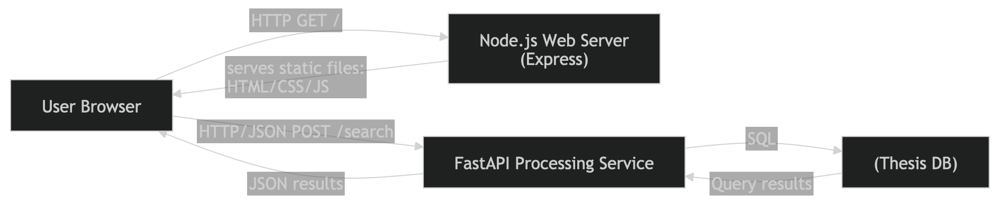
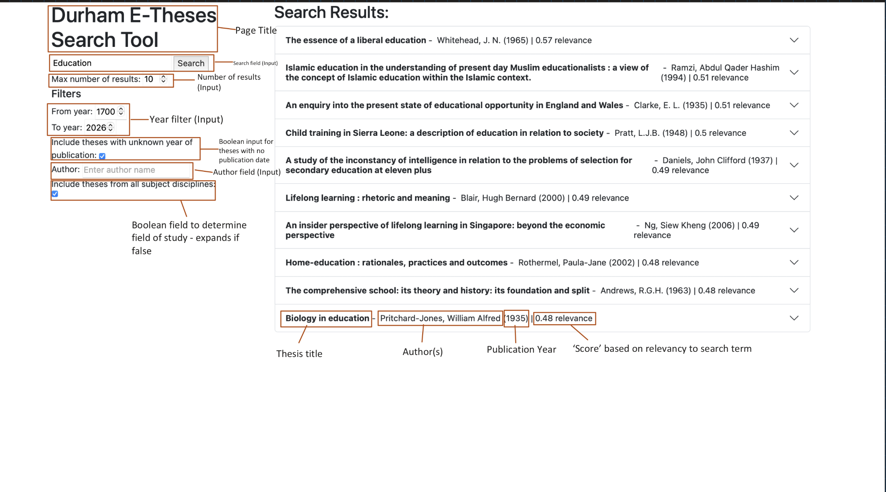
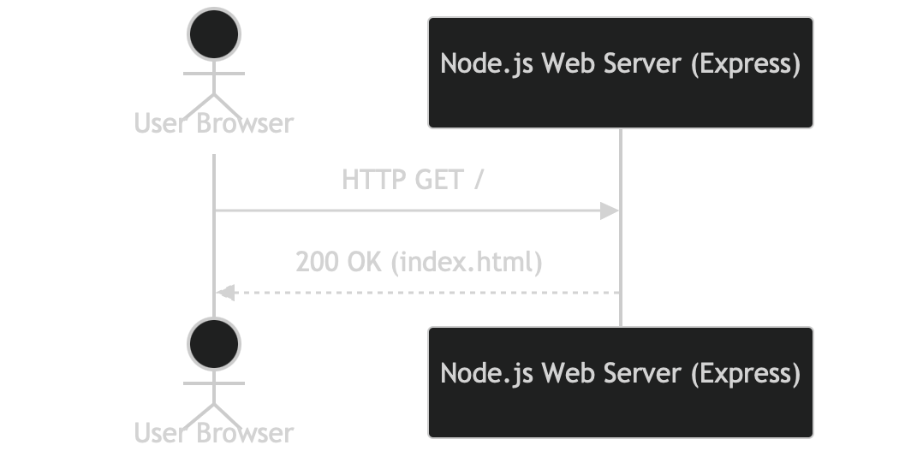
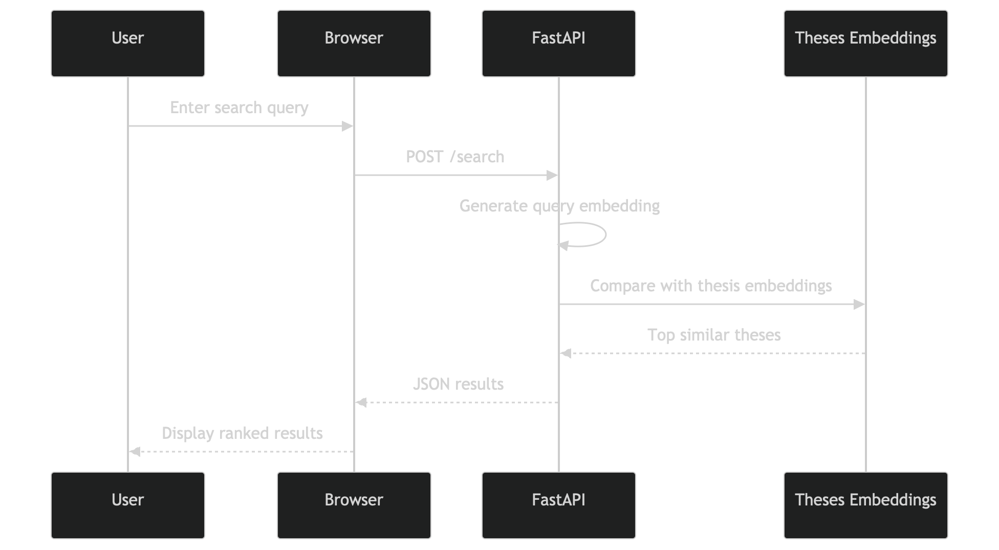

# 2.2.1 System Architecture
The following diagram shows a high-level overview of the system architecture: 

<!-- The system makes use of five separate components:
- Frontend (HTML/CSS)
- Client-side logic (JS)
- Node.js express server
- FastAPI (Python) server
- SQLite Database

The user interacts with the system through a JavaScript-supported web interface, which is served by a Node.js server and FastAPI server. The Node.js server is responsible for web delivery whereas the FastAPI server is responsible for the thesis' search, and the APIs are completely independent from each other. -->

# 2.2.2 Design Principles 
## 1 .Separation of Concerns
## 2. Efficiency of Information Retrieval 
## 3. Modularity and Extensibility
## 4. Performance & Scalability
## 5. Simplicity of User Interaction
# 2.2.5 System Functionalities

## Search Page Displayed
### High-level Functionality
The system provides a web interface allowing users to search the thesis database, with a number of features including a search field, filters (year, author, discipline), and a results display. The following image displays the search page with labels:

### Architecture & Component Interaction
There are four components to display the search page:
| Component                         | Role                                                         |
|----------------------------------|--------------------------------------------------------------|
| Frontend (HTML/JS)               | HTML page, which is used to (1) render the user interface and (2) structure & style it. |
| Client-side logic               | JavaScript handles user input and sends search requests. |
| Node.js Express server  | Serves the frontend (webpage) and handles API routing.     |
| FastAPI (Python) service           | Performs processing such as searching or retrieving thesis data.|

### Sequence Diagram
The following sequence diagram shows how the search page is delivered to the user. Node.js (Express) serves the static frontend assets (HTML/CSS/JS); no FastAPI interaction occurs at this stage.

## Search Query Processing
### High-level Functionality
The system provides a set of results with respect to the semantic meaning of the user's entered search query. The user query and thesis title & abstract are covnerted into vector embeddings using a pre-trained sentence embedding model.These embeddings represent the semantic meaning of the text in a high-dimensional vector space. Each result consists of the thesis title, author(s), publication year, and score - how semantically similar/relevant the title and abstract of the thesis is to the user's search query (higher score ⇒ more relevant), which is computed using cosine similarity. The results are listed in order of score descending. 

**Behavioural Requirement(s)**: 

### Architecture & Component Interaction
There are four components used in processing the user's search query:
| Component                         | Role                                                         |
|----------------------------------|--------------------------------------------------------------|
| Frontend (HTML/JS)               | Collects search input and sends query to backend            |
| FastAPI service                  | Processes search requests and performs semantic similarity ranking |
| Vector search / embedding model  | Converts text into vector representations                    |
| Thesis dataset / index           | Stores thesis metadata and embeddings                        |

*Note: Node.js only serves the frontend assets (HTML/CSS/JS), and FastAPI is called directly by the frontend and not via Node.js. This keeps the web server lightweight and concentrates search logic in the Python service.*

### Search Processing Pipeline
#### Step 1: Query Submission
The user enters a search query in the web interface.
The frontend sends a JSON request to the FastAPI endpoint:

`POST /search`

The request includes:
- the search query,
- maximum number of results,
- filter parameters

#### Step 2: Query embedding generation
The FastAPI service converts the query into a vector embedding using a pre-trained text embedding model. THe vector embedding represents the semantic meaning of the search query in a high-dimensional vector space.

#### Step 3: Thesis Embedding Comparison
The query's vector embedding is compared against each thesis' precomputed title and abstract vector embedding in the database using cosine similarity, enabling the system to obtain the theses with the closest semantic similarity to the user's search query.

#### Step 4: Ranking & Response
The chosen theses are then ranked by similarity score before being returned as JSON by the API containing:
- thesis title,
- thesis author(s)
- thesis publication year
- thesis score

#### Sequence Diagram
The following diagram demonstrates the sequence structure of query processing:

### Technologies & Platforms
The following technologies/platforms were used with their respective roles outlined:
| Technology                                | Purpose                                      |
|--------------------------------------------|----------------------------------------------|
| FastAPI                                    | REST API for search requests                 |
| Python                                     | Backend processing                           |
| Embedding model (e.g., Sentence Transformers) | Semantic text representation                  |
| Vector similarity search (e.g., FAISS)     | Efficient nearest-neighbour retrieval        |
| JavaScript (Fetch API)                     | Sending search requests from the frontend    |

