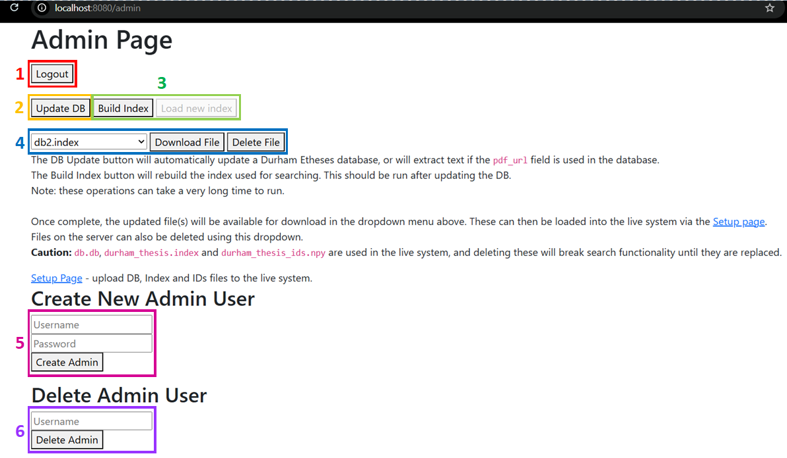
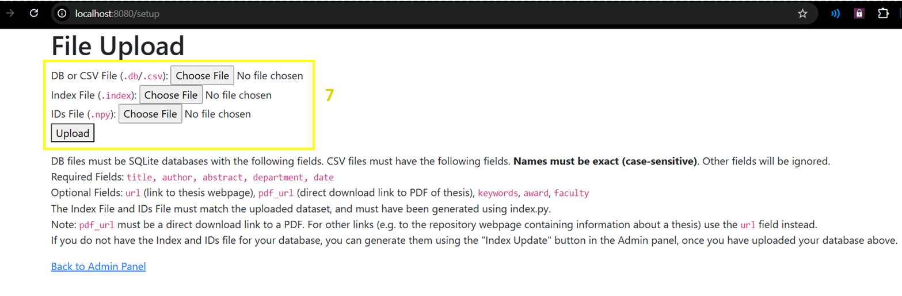

**The Admin Page**  
Most basic maintenance tasks can be performed from the admin page, including updating the database, rebuilding the Faiss index used by the model and managing admin accounts. The admin page can be accessed (when the server is running locally, see Section 3.2) from `localhost:8080/admin`. The below images show the admin page and the setup page with each part numbered \- these numberings will be used throughout this section to explain how to perform each task.  
Admin page:  

Setup Page:  

**Accessing the Admin Page**  
To access the admin page, you need to be logged into the system with an admin account. If you are not, you will be redirected to a login screen where you will have to enter your admin credentials before being able to access the page.

**Logging Out**  
You can log out of your admin account by clicking the Logout button (**1**). This will clear the login cookie from your browser and redirect you back to the login screen.

**Uploading a New Database**  
From the “File Upload” form (**7**) on the Setup Page, a database can be uploaded, along with the index and IDs files used by the model. If you do not currently have the model index/IDs for the database being uploaded, leave these fields blank, otherwise ensure they are of the correct file format (`.index` and `.npy`).  
Uploaded databases can take the form of an SQLite database file (`.db`) with a table named `Thesis`, or a CSV file (`.csv`), with the following required fields:  
`title, author, abstract, department, date, pdf_url`  
Other optional fields: `keywords, award, faculty, url` (not currently used by the system).  
Any other fields will be deleted.  
Note: `pdf_url` must be the direct URL to the PDF of the thesis (e.g. [https://etheses.dur.ac.uk/16472/1/Chen000923656.pdf](https://etheses.dur.ac.uk/16472/1/Chen000923656.pdf)) as this is where the OCR function will look for PDFs to extract the text from. For other URLs, e.g. the link to the thesis’ repository page, use the `url` field.  
Once the database has been uploaded, build the model index (if not being uploaded alongside the database) and update it to include the PDF text (see below).

*Caution*: When uploading a database without its corresponding index *and* IDs files, searching will not work until the index has been rebuilt. *Any mismatch between the database, index file or IDs file will cause unpredictable behaviour or errors during search*.

**Building the Model Index**  
The model index can be built by clicking the “Build Index” button (**3**), which will create the new index/IDs files, then click the “Load New Index” button (**3**) to apply this new index to the live system.

**Updating the Database**  
To update the database currently in use by the system to include the text from the thesis PDFs (required for AI Summarisation features to work), click the “Update DB” button (**2**). For large datasets where a large number of theses need to be scanned using OCR, this process can take several hours or days. The page does not have to be open during this time, the process will run on the server so long as the server’s connection to the Internet remains stable.  
Note: since the system currently uses a Durham E-Theses database, this process also checks the Durham E-Theses website for the latest thesis additions and adds these to the database used by the system. If using another dataset, e.g. EThOS, this functionality would need to be replaced or removed (see Section 4.2.1).

**Downloading the Current Database**  
The current database used by the system can be downloaded by selecting the corresponding file (currently `db.db`) in the dropdown menu (**4**) and clicking “Download File”. Once downloaded, any changes can be made to the database contents, before reuploading to the system following the steps outlined above. Index and IDs files can also be downloaded in this manner.

**Creating and Deleting Admin Accounts**  
A new Admin account can be created via the “Create New Admin User” form (**5**). Here, the username and password for the new admin account can be entered, and provided the username does not already exist, a new account will be created on form submission.  
Admin accounts can also be created via the command line on the server. To do this, `cd` into the `python` directory and run:  
`python create_admin.py <username> <password>`  
where `<username>` and `<password>` are the credentials for the admin account.

Admin accounts can be deleted via the “Delete Admin User” form (**6**), where the username of the admin account to be deleted can be entered, and the account will be deleted on submission of the form. If, for whatever reason, an admin user deletes their own account, they will be immediately logged out.